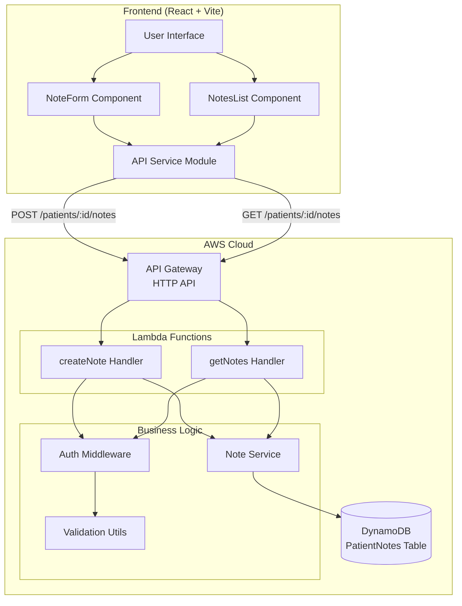

# Design Document: Healthcare CRM Application

## Overview

The Healthcare CRM Application is a full-stack serverless system that enables clinic staff to create and retrieve patient follow-up notes. The system consists of two primary components:

1. **Backend API**: AWS serverless infrastructure using Lambda functions, API Gateway, and DynamoDB
2. **Frontend Application**: React-based web interface built with Vite

The architecture follows a clean separation of concerns with modular backend services and component-based frontend design. Authentication is handled via a simple x-user-id header mechanism (suitable for demo/internal use). The system prioritizes scalability through serverless architecture and maintainability through clear module boundaries.

## Architecture

### System Architecture



### Technology Stack

**Backend:**
- Runtime: Node.js 18.x
- Language: TypeScript
- Framework: Serverless Framework
- Cloud Provider: AWS (Lambda, API Gateway, DynamoDB)
- AWS SDK: @aws-sdk/client-dynamodb v3
- UUID Generation: uuid library

**Frontend:**
- Framework: React 18
- Build Tool: Vite
- Language: JavaScript (JSX)
- HTTP Client: Fetch API
- Styling: Plain CSS

### Deployment Model

The backend deploys as independent Lambda functions behind API Gateway, with DynamoDB provisioned via CloudFormation through Serverless Framework. The frontend builds as static assets served via Vite dev server (development) or static hosting (production).

## Components and Interfaces

### Backend Components

#### Lambda Handlers

**handlers/notes.ts** — Single parent file for all note operations
- Exports: `createNoteHandler`, `getNotesHandler`, `updateNoteHandler`, `deleteNoteHandler`
- All future note-related API endpoints are added to this file
- Routes:
  - POST /notes → `createNoteHandler`
  - GET /patients/{patientId}/notes → `getNotesHandler`
  - PUT /notes/{noteId} → `updateNoteHandler`
  - DELETE /notes/{noteId} → `deleteNoteHandler`

**handlers/patients.ts** — Single parent file for all patient operations
- Exports: `listHandler`, `createHandler`, `deleteHandler`
- Routes:
  - GET /patients → `listHandler`
  - POST /patients → `createHandler` (auto-generates patientId UUID, user provides name only)
  - DELETE /patients/{patientId} → `deleteHandler`

#### Service Layer

**noteService.ts**
- Core business logic for note operations
- Functions:
  - `createNote(patientId: string, content: string, userId: string): Promise<Note>`
    - Generates UUID for noteId
    - Creates ISO 8601 timestamp
    - Persists note to DynamoDB
    - Returns created note object
  - `getNotesByPatient(patientId: string): Promise<Note[]>`
    - Queries DynamoDB by patientId
    - Sorts results by createdAt descending
    - Returns array of notes

#### Utility Modules

**dbClient.ts**
- Exports configured DynamoDB DocumentClient
- Handles AWS SDK v3 client initialization
- Provides singleton client instance

**response.ts**
- Helper functions for HTTP response formatting
- Functions:
  - `success(statusCode: number, data: any): APIGatewayProxyResult`
  - `error(statusCode: number, message: string): APIGatewayProxyResult`
- Ensures consistent JSON response structure with CORS headers

**auth.ts**
- Authentication middleware
- Functions:
  - `extractUserId(event: APIGatewayProxyEvent): string | null`
  - Validates presence of x-user-id header
  - Returns user identifier or null

**validation.ts**
- Input validation utilities
- Functions:
  - `validateNoteContent(content: any): boolean`
  - `validatePatientId(patientId: any): boolean`
- Returns validation results with error messages

#### Type Definitions

**types/note.ts**
```typescript
export interface Note {
  noteId: string;
  patientId: string;
  content: string;
  createdAt: string;
  createdBy: string;
}

export interface CreateNoteRequest {
  content: string;
}
```

### Frontend Components

#### React Components

**NoteForm.jsx**
- Controlled form component for note submission
- State:
  - `content`: string (textarea value)
  - `isSubmitting`: boolean (loading state)
  - `error`: string | null (error message)
- Props: `onNoteCreated` callback function
- Responsibilities:
  - Validate non-empty content before submission
  - Call API service to create note
  - Handle loading and error states
  - Clear form on successful submission
  - Trigger parent refresh via callback

**NotesList.jsx**
- Display component for patient notes
- State:
  - `notes`: Note[] (list of notes)
  - `loading`: boolean (loading state)
  - `error`: string | null (error message)
- Props: `patientId` string
- Responsibilities:
  - Fetch notes on component mount
  - Display notes in descending chronological order
  - Show loading indicator during fetch
  - Display error messages on failure
  - Format timestamps for display

**App.jsx**
- Root application component
- Responsibilities:
  - Compose NoteForm and NotesList components
  - Manage patient context (hardcoded to "patient-123")
  - Handle note creation callback to refresh list
  - Provide application layout and styling

#### Service Module

**api.js**
- HTTP client for backend communication
- Configuration:
  - Base URL: http://localhost:3000
  - Default headers: x-user-id, Content-Type
- Functions:
  - `getNotes(patientId: string): Promise<Note[]>`
  - `createNote(patientId: string, content: string): Promise<Note>`
- Error handling: Throws on non-2xx responses with error messages

### API Interface Specification

#### POST /patients/{patientId}/notes

**Request:**
```
POST /patients/{patientId}/notes
Headers:
  x-user-id: string (required)
  Content-Type: application/json
Body:
  {
    "content": "string (required, non-empty)"
  }
```

**Success Response (201):**
```json
{
  "noteId": "uuid-string",
  "patientId": "string",
  "content": "string",
  "createdAt": "ISO-8601-timestamp",
  "createdBy": "string"
}
```

**Error Responses:**
- 400: Invalid request (missing/empty content, invalid patientId)
- 401: Missing authentication header
- 500: Internal server error

#### GET /patients/{patientId}/notes

**Request:**
```
GET /patients/{patientId}/notes
Headers:
  x-user-id: string (required)
```

**Success Response (200):**
```json
[
  {
    "noteId": "uuid-string",
    "patientId": "string",
    "content": "string",
    "createdAt": "ISO-8601-timestamp",
    "createdBy": "string"
  }
]
```

**Error Responses:**
- 400: Invalid patientId
- 401: Missing authentication header
- 500: Internal server error

## Data Models

### Note Entity

The core data entity representing a patient follow-up note.

**Schema:**
```typescript
{
  noteId: string;        // UUID v4 format
  patientId: string;     // Patient identifier
  content: string;       // Note content (non-empty)
  createdAt: string;     // ISO 8601 timestamp
  createdBy: string;     // User identifier from x-user-id header
}
```

**Constraints:**
- noteId: Must be valid UUID v4
- patientId: Required, non-empty string
- content: Required, non-empty string (after trimming whitespace)
- createdAt: Must be valid ISO 8601 format
- createdBy: Required, non-empty string

### DynamoDB Table Design

**Table Name:** PatientNotes

**Key Schema:**
- Partition Key: `patientId` (String)
- Sort Key: `noteId` (String)

**Attributes:**
- patientId (String)
- noteId (String)
- content (String)
- createdAt (String)
- createdBy (String)

**Access Patterns:**
1. Create note: PutItem with patientId + noteId
2. Get all notes for patient: Query by patientId, sort by createdAt

**Rationale:**
- Partition key on patientId enables efficient queries for all notes belonging to a patient
- Sort key on noteId ensures unique note identification
- No secondary indexes needed for current requirements
- createdAt stored as string for simplicity (sorting handled in application layer)


## Correctness Properties

*A property is a characteristic or behavior that should hold true across all valid executions of a system—essentially, a formal statement about what the system should do. Properties serve as the bridge between human-readable specifications and machine-verifiable correctness guarantees.*

### Backend API Properties

### Property 1: Note Creation Round-Trip

*For any* valid patientId, content string, and userId, when a note is created via POST and then retrieved via GET, the retrieved note should contain the same content, patientId, and createdBy values, with a valid UUID noteId.

**Validates: Requirements 1.1, 1.2, 1.3**

### Property 2: Timestamp Format Validity

*For any* created note, the createdAt field should be a valid ISO 8601 formatted timestamp string.

**Validates: Requirements 1.5**

### Property 3: Authentication Propagation

*For any* note creation request with a valid x-user-id header value, the created note's createdBy field should exactly match that header value.

**Validates: Requirements 1.6**

### Property 4: Retrieval Completeness and Ordering

*For any* patientId with N notes created at different times, retrieving notes for that patient should return exactly N notes sorted by createdAt in descending order (newest first).

**Validates: Requirements 2.1, 2.2, 2.3**

### Property 5: Content Validation Rejection

*For any* string that is empty or contains only whitespace, attempting to create a note with that content should return a 400 status code with an error message, and no note should be created.

**Validates: Requirements 3.1, 3.3**

### Property 6: PatientId Validation Rejection

*For any* request with a missing or empty patientId, the Backend_API should return a 400 status code with a descriptive error message.

**Validates: Requirements 3.2, 3.4**

### Property 7: Authentication Requirement

*For any* API request missing the x-user-id header, the Backend_API should return a 401 status code with an error message and not process the request.

**Validates: Requirements 4.1**

### Property 8: CORS Headers Presence

*For any* HTTP response from the Backend_API, the response should include appropriate CORS headers (Access-Control-Allow-Origin, Access-Control-Allow-Headers, Access-Control-Allow-Methods).

**Validates: Requirements 6.1**

### Property 9: JSON Response Format

*For any* successful API response, the response should have Content-Type application/json and the body should be valid JSON.

**Validates: Requirements 14.1, 14.5**

### Property 10: Error Response Structure

*For any* error response (4xx or 5xx status codes), the response body should be valid JSON containing an error message field.

**Validates: Requirements 14.2**

### Frontend Application Properties

### Property 11: Display Sorting Consistency

*For any* array of notes received from the API, the Frontend_Application should display them in descending order by createdAt timestamp.

**Validates: Requirements 7.2**

### Property 12: Note Content Display Completeness

*For any* note in the notes list, the rendered display should include both the content text and the createdAt timestamp.

**Validates: Requirements 7.3**

### Property 13: Loading State Management

*For any* notes fetch operation, the Frontend_Application should display a loading indicator while the request is in progress and hide it once complete.

**Validates: Requirements 7.4**

### Property 14: Empty Content Submission Prevention

*For any* string that is empty or contains only whitespace, the NoteForm component should prevent submission and display a validation message when the submit button is clicked.

**Validates: Requirements 8.3**

### Property 15: Form Reset After Submission

*For any* successful note submission, the NoteForm component should clear the textarea content and trigger a refresh of the notes list.

**Validates: Requirements 8.4**

### Property 16: Error Display on Failure

*For any* failed note submission or fetch operation, the Frontend_Application should display an error message to the user.

**Validates: Requirements 8.5, 9.5**

### Property 17: Request Header Inclusion

*For any* API request from the Frontend_Application, the request should include the x-user-id header with value "demo-user", and POST requests should additionally include Content-Type header with value "application/json".

**Validates: Requirements 9.2, 9.3**

## Error Handling

### Backend Error Handling

**Validation Errors (400 Bad Request):**
- Empty or missing content field
- Invalid or missing patientId
- Malformed request body
- Response includes descriptive error message

**Authentication Errors (401 Unauthorized):**
- Missing x-user-id header
- Response includes authentication error message

**Server Errors (500 Internal Server Error):**
- DynamoDB operation failures
- Unexpected runtime errors
- Response includes generic error message (no sensitive details exposed)

**Error Response Format:**
```json
{
  "error": "Descriptive error message"
}
```

**Error Handling Strategy:**
- All Lambda handlers wrapped in try-catch blocks
- Validation performed before business logic execution
- Authentication checked before processing requests
- DynamoDB errors caught and logged
- User-friendly error messages returned (no stack traces in production)

### Frontend Error Handling

**Network Errors:**
- Failed fetch requests
- Timeout scenarios
- Display user-friendly error message in UI

**API Errors:**
- 4xx and 5xx responses from backend
- Parse error message from response body
- Display error message to user

**Validation Errors:**
- Client-side validation before submission
- Prevent invalid requests from being sent
- Display validation messages inline

**Error Display Strategy:**
- Error messages shown in red text near relevant UI elements
- Errors cleared on successful operations
- Loading states prevent duplicate submissions
- Graceful degradation (show error, don't crash)

## Testing Strategy

### Dual Testing Approach

The testing strategy employs both unit tests and property-based tests as complementary approaches:

**Unit Tests:**
- Verify specific examples and edge cases
- Test integration points between components
- Validate error conditions with known inputs
- Focus on concrete scenarios that demonstrate correct behavior

**Property-Based Tests:**
- Verify universal properties across all inputs
- Use randomized input generation for comprehensive coverage
- Validate invariants that should hold for any valid input
- Each test runs minimum 100 iterations

Both approaches are necessary: unit tests catch concrete bugs and verify specific behaviors, while property tests ensure general correctness across the input space.

### Backend Testing

**Property-Based Tests (using fast-check for TypeScript):**

Each property from the Correctness Properties section should be implemented as a property-based test:

1. **Property 1 Test**: Generate random patientId, content, userId → create note → retrieve notes → verify note exists with correct data
   - Tag: `Feature: healthcare-crm-app, Property 1: Note Creation Round-Trip`
   - Iterations: 100

2. **Property 2 Test**: Generate random notes → verify createdAt matches ISO 8601 regex pattern
   - Tag: `Feature: healthcare-crm-app, Property 2: Timestamp Format Validity`
   - Iterations: 100

3. **Property 3 Test**: Generate random userId values → create note with x-user-id → verify createdBy matches
   - Tag: `Feature: healthcare-crm-app, Property 3: Authentication Propagation`
   - Iterations: 100

4. **Property 4 Test**: Generate N random notes with different timestamps → retrieve → verify count and descending order
   - Tag: `Feature: healthcare-crm-app, Property 4: Retrieval Completeness and Ordering`
   - Iterations: 100

5. **Property 5 Test**: Generate whitespace-only strings → attempt creation → verify 400 response
   - Tag: `Feature: healthcare-crm-app, Property 5: Content Validation Rejection`
   - Iterations: 100

6. **Property 6 Test**: Generate invalid patientId values → attempt creation → verify 400 response
   - Tag: `Feature: healthcare-crm-app, Property 6: PatientId Validation Rejection`
   - Iterations: 100

7. **Property 7 Test**: Generate requests without x-user-id → verify 401 response
   - Tag: `Feature: healthcare-crm-app, Property 7: Authentication Requirement`
   - Iterations: 100

8. **Property 8 Test**: Generate random valid requests → verify CORS headers in response
   - Tag: `Feature: healthcare-crm-app, Property 8: CORS Headers Presence`
   - Iterations: 100

9. **Property 9 Test**: Generate random successful requests → verify Content-Type and valid JSON
   - Tag: `Feature: healthcare-crm-app, Property 9: JSON Response Format`
   - Iterations: 100

10. **Property 10 Test**: Generate various error conditions → verify JSON error response structure
    - Tag: `Feature: healthcare-crm-app, Property 10: Error Response Structure`
    - Iterations: 100

**Unit Tests:**

Focus on specific examples and integration:
- Create note with specific content and verify exact response
- Retrieve notes for patient with no notes (empty array edge case)
- Error messages contain helpful information
- DynamoDB client integration (mock DynamoDB)
- Response helper functions format correctly
- Auth middleware extracts userId correctly
- Validation functions reject specific invalid inputs

**Test Structure:**
```
backend/
  tests/
    unit/
      noteService.test.ts
      validation.test.ts
      auth.test.ts
      response.test.ts
    properties/
      noteCreation.property.test.ts
      noteRetrieval.property.test.ts
      validation.property.test.ts
      auth.property.test.ts
```

### Frontend Testing

**Property-Based Tests (using fast-check for JavaScript):**

11. **Property 11 Test**: Generate random note arrays → verify display order matches descending createdAt
    - Tag: `Feature: healthcare-crm-app, Property 11: Display Sorting Consistency`
    - Iterations: 100

12. **Property 12 Test**: Generate random notes → verify rendered output contains content and createdAt
    - Tag: `Feature: healthcare-crm-app, Property 12: Note Content Display Completeness`
    - Iterations: 100

13. **Property 13 Test**: Simulate fetch operations → verify loading state is true during fetch and false after
    - Tag: `Feature: healthcare-crm-app, Property 13: Loading State Management`
    - Iterations: 100

14. **Property 14 Test**: Generate whitespace-only strings → verify submission prevented and validation shown
    - Tag: `Feature: healthcare-crm-app, Property 14: Empty Content Submission Prevention`
    - Iterations: 100

15. **Property 15 Test**: Simulate successful submission → verify form cleared and list refreshed
    - Tag: `Feature: healthcare-crm-app, Property 15: Form Reset After Submission`
    - Iterations: 100

16. **Property 16 Test**: Simulate API failures → verify error message displayed
    - Tag: `Feature: healthcare-crm-app, Property 16: Error Display on Failure`
    - Iterations: 100

17. **Property 17 Test**: Generate random API calls → verify headers include x-user-id and Content-Type (for POST)
    - Tag: `Feature: healthcare-crm-app, Property 17: Request Header Inclusion`
    - Iterations: 100

**Unit Tests:**

Focus on component behavior and integration:
- NoteForm renders with textarea and button
- NotesList renders notes correctly
- API service constructs correct URLs
- Specific error messages display correctly
- Form validation shows specific messages
- Component integration in App.jsx

**Test Structure:**
```
frontend/
  tests/
    unit/
      NoteForm.test.jsx
      NotesList.test.jsx
      api.test.js
    properties/
      noteDisplay.property.test.js
      formValidation.property.test.js
      apiClient.property.test.js
```

### Testing Tools

**Backend:**
- Test Framework: Jest or Vitest
- Property Testing: fast-check
- Mocking: AWS SDK mocks for DynamoDB

**Frontend:**
- Test Framework: Vitest
- Property Testing: fast-check
- Component Testing: React Testing Library
- HTTP Mocking: MSW (Mock Service Worker)

### Test Execution

**Backend:**
```bash
cd backend
npm test                    # Run all tests
npm test -- --coverage      # With coverage report
```

**Frontend:**
```bash
cd frontend
npm test                    # Run all tests
npm test -- --coverage      # With coverage report
```

**Coverage Goals:**
- Minimum 80% code coverage for both backend and frontend
- 100% coverage of critical paths (note creation, retrieval, validation)
- All correctness properties implemented as property-based tests

